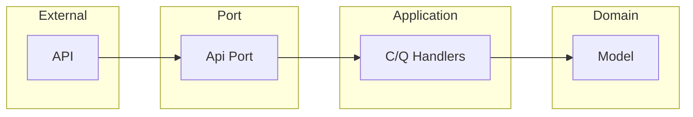
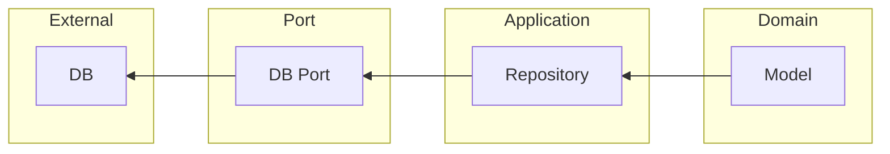

### Data flow for a request

```mermaid
flowchart LR
    direction LR
    A[API] --> ApiPort[Api Port] --> CQ[C/Q Handlers] --> M[Model]
    subgraph External
        A
    end
    subgraph Port
        ApiPort
    end
    subgraph Application
        CQ
    end
   subgraph Domain
        M
    end
```

```mermaid
flowchart RL
    M[Model] --> R[Repository] --> DbPort[DB Port] --> DB[DB]
    subgraph External
        DB
    end
    subgraph Port
        DbPort
    end
    subgraph Application
        R
    end
   subgraph Domain
        M
    end
```
